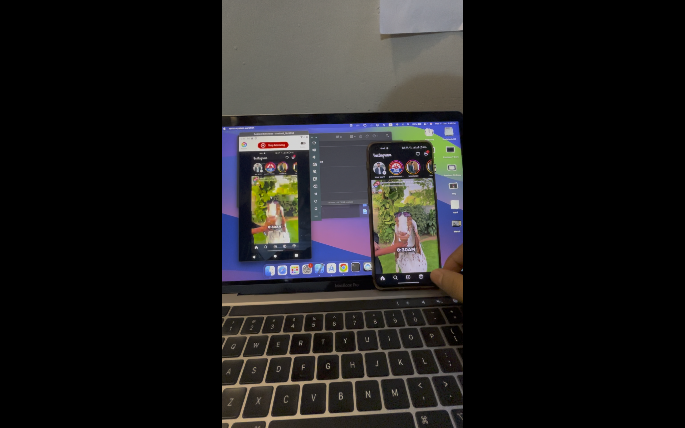
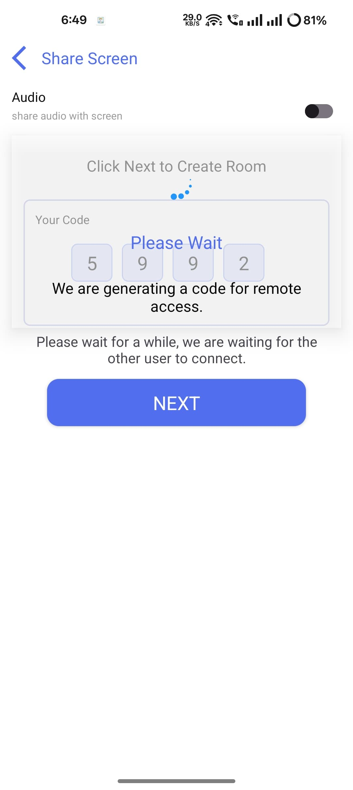
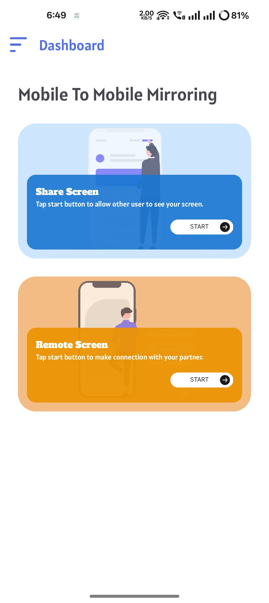

# 📱 Mobile to Mobile Mirroring (Kotlin)

This Android application allows users to mirror their screen from one mobile device to another using Kotlin and the Agora SDK. The project supports background audio transmission, screen control, and screenshot capturing between two devices.

---

## ✨ Features

- 📡 Real-time mobile-to-mobile screen mirroring
- 🔊 Background audio transmission via **Twillio SDK**
- 🎮 Remote screen control from the receiving device
- 📷 Screenshot capture support

---

## 🛠️ Tech Stack

- **Language:** Kotlin
- **Streaming SDK:** Agora SDK
- **Realtime Communication (optional):** Twilio (for signaling)
- **Architecture:** MVVM
- **Background Processing:** Foreground Service

---

## 🚀 Getting Started

### 1. Clone the Repository

```bash
git clone https://github.com/ShahzaibAli02/MobileToMobile.git
cd mobile-mirroring-kotlin 
```
### 2. Configure Local Properties
## Add the following lines to your local.properties file in the root directory:

# Twilio Credentials (if used)
TWILIO_ACCOUNT_SID=your_account_sid_here
TWILIO_API_KEY=your_api_key_here
TWILIO_API_SECRET=your_api_secret_here


### 3. Screenshots






